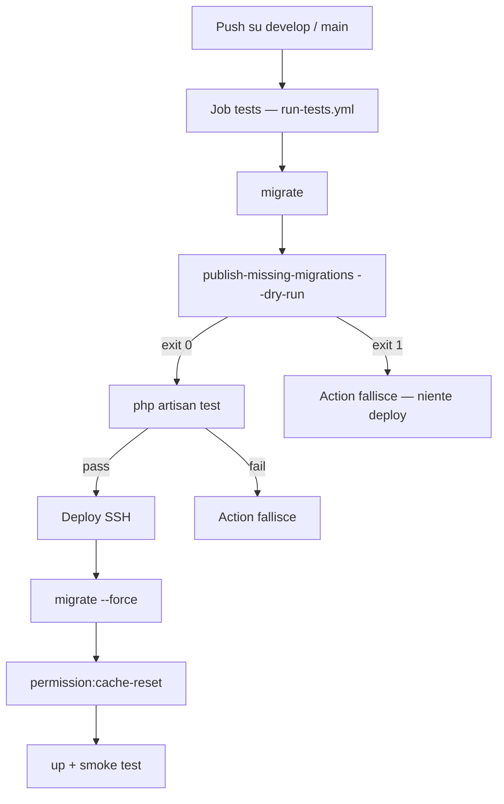
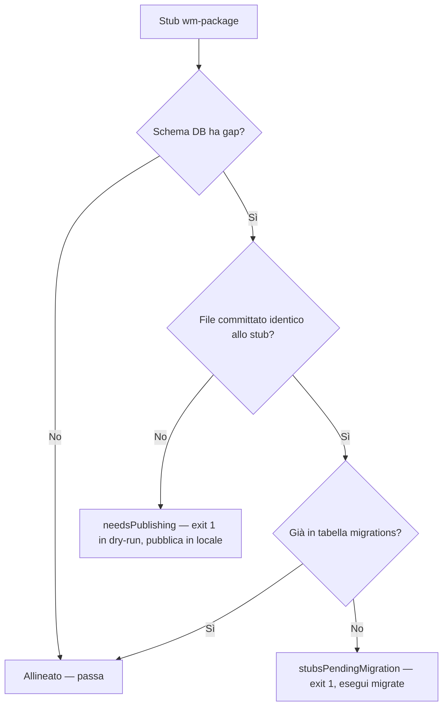
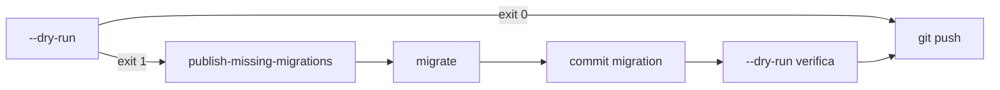

> Ticket: oc:8218

# CI/CD: gate migration wm-package + invalidazione cache permessi

## Ticket originale vs design finale

| Aspetto | Richiesta ticket (oc:8218) | Design implementato |
|---------|---------------------------|---------------------|
| **Rischio 1** — stub wm-package non pubblicati | `vendor:publish --tag=wm-package-migrations` negli script di deploy | **Rifiutato**: genera file orfani sul server. Le migration arrivano solo via git |
| **Rischio 2** — cache Spatie stale | `permission:cache-reset` dopo `migrate` | **Implementato** in `deploy_dev.sh` / `deploy_prod.sh` |
| **Gate pre-deploy** | Job CI che confronta stub vs `database/migrations/` | **Implementato**: `publish-missing-migrations --dry-run` nel job `tests` |
| **Dove gira il gate** | Non specificato | In CI, dopo `migrate` e prima dei test — mai negli script SSH |
| **Criterio gate** | Confronto filesystem | Stub obbligatori vs **schema DB reale** dopo `migrate` |

Gli stub wm-package **non sono opzionali**: definiscono schema e dati che il package si aspetta sul database del consumer.

---

## Diagrammi di flusso

### Pipeline CI/CD completa



### Gate per singolo stub (dopo migrate)



### Workflow developer



---

## Pipeline CI/CD (sintesi)

### Job `tests` (`run-tests.yml`)

- `migrate` → `publish-missing-migrations --dry-run` → `php artisan test`
- Un solo container PostGIS: gate e test usano lo stesso schema
- `--dry-run` con exit non-zero blocca test e deploy

### Job `deploy` (`deploy_dev.sh` / `deploy_prod.sh`)

- `down` → `composer install` → `optimize` → `migrate --force` → `permission:cache-reset` → horizon terminate → `up`
- **Nessun** `vendor:publish` — le migration arrivano via git
- Gate in CI: `publish-missing-migrations --dry-run` nel job `tests` (dopo `migrate`)
- `permission:cache-reset` sempre dopo `migrate`, incondizionatamente

---

## Comandi wm-package

| Comando | Ruolo |
|---------|--------|
| `wm-package:publish-missing-migrations` | Workflow principale: confronta stub vs schema DB; pubblica file mancanti |
| `wm-package:publish-missing-migrations --dry-run` | Gate CI e verifica locale pre-push |
| `wm-package:publish-migration <stub>` | Publish di un singolo stub (caso puntuale) |

### Logica di allineamento (per ogni stub)

1. Legge tabelle/colonne/ruoli attesi dallo stub
2. Confronta con lo **schema DB reale**
3. **Schema già completo** → stub allineato (anche senza file wm-package committato, se un'altra migration ha prodotto lo stesso effetto)
4. **File committato identico allo stub** ma non migrato → fallisce, suggerisce `migrate`
5. **Schema mancante e nessun file identico** → `needsPublishing` → pubblica (o segnala in `--dry-run`)

Il **suffisso del nome file da solo non basta** — caso `create_users_table` su maphub: esiste `0001_..._create_users_table.php` (Laravel) ma mancano `balance`, `fiscal_code`, `app_id`.

---

## Workflow developer

```bash
php artisan wm-package:publish-missing-migrations --dry-run   # = gate CI
php artisan wm-package:publish-missing-migrations             # se serve
php artisan migrate
git add database/migrations/ && git commit
git push
```

### Se il gate blocca

Per ogni stub elencato:

1. Leggi `wm-package/database/migrations/<nome>.php.stub`
2. Verifica se un'altra migration committata produce già lo stesso effetto sul DB
3. **Schema già ok** → nessuna azione (il gate dovrebbe passare; se non passa, verifica `migrate`)
4. **Manca sul DB** → `publish-migration <stub>` o `publish-missing-migrations` + `migrate` + commit
5. **File identico committato ma non migrato** → `php artisan migrate`

Risoluzione **sempre in locale → git**, mai sul server.

---

## Casi d'uso

### A. Progetto allineato — push normale

| Step | Comportamento |
|------|----------------|
| Migration in git coprono tutti gli stub | CI: `migrate` → `--dry-run` exit `0` → test passano → deploy |
| Server | `migrate --force` (idempotente) → `permission:cache-reset` → app up |

### B. Nuovo stub wm-package dopo aggiornamento submodule

| Step | Comportamento |
|------|----------------|
| Locale | `--dry-run` segnala il nuovo stub |
| Locale | `publish-missing-migrations` → genera file in `database/migrations/` |
| Locale | `migrate` → commit → push |
| CI | Gate passa → deploy applica la migration |

### C. Falso positivo da suffisso — `create_users_table` (maphub)

| Fatto | Dettaglio |
|-------|-----------|
| File esistente | `0001_..._create_users_table.php` — migration **Laravel** (`Schema::create`) |
| Stub wm-package | `Schema::table('users')` con `balance`, `fiscal_code`, `app_id` |
| Suffisso uguale, contenuto diverso | Colonne assenti sul DB |

| Comando | Esito |
|---------|--------|
| `--dry-run` | Exit `1` — elenca gap colonne |
| `publish-migration create_users_table` | Pubblica migration wm-package vera |
| Dopo `migrate` + commit | CI passa |

### D. Migration committata ma non migrata in locale

| Condizione | `publishedFileMatchesStubContent` = true, riga assente in `migrations` |
| Comando | `--dry-run` exit `1` — "migration già pubblicata ma non applicata" |
| Fix | `php artisan migrate` |

### E. Migration custom equivalente già sul DB

| Condizione | Un altro file (nome diverso) ha già creato colonne/tabelle/ruoli dello stub |
| Comando | `isAppliedToDatabase` = true → `--dry-run` exit `0` |
| Azione | Nessuna — non serve pubblicare file wm-package |

### F. Push con migration mancanti in git

| CI | `migrate` non applica ciò che non è committato → `--dry-run` fallisce |
| Deploy | Non parte (`needs: [tests]`) |
| Fix | Sempre locale → commit → push |

### G. Deploy manuale bypassando la CI

| Comportamento | `migrate --force` nel container funziona ancora |
| Gate | Nessuno sul server — rete di sicurezza solo in CI |
| Rischio | Residuo accettato |

### H. Cache permessi Spatie stale dopo migration ruoli

| Deploy | `permission:cache-reset` sempre dopo `migrate --force`, incondizionatamente |

### Comandi — esiti rapidi

| Comando | Exit `0` | Exit `1` |
|---------|----------|----------|
| `--dry-run` | Tutti gli stub allineati al DB | Stub da pubblicare o file identico non migrato |
| `publish-missing-migrations` | File pubblicati; reminder commit + migrate | Errore copia, o `pendingMigrate` dopo publish |
| `publish-migration <stub>` | Pubblicato, o schema già applicato | Stub sconosciuto, file identico non migrato |

---

## Perché

Review oc:8161: lockout Nova silenzioso da migration stub non eseguite e cache Spatie stale. Il gate `viewNova` è fail-closed by design — il problema è operativo.

---

## Requisiti

- [x] Gate nel job `tests`; `deploy` dipende solo da `tests`
- [x] Deploy senza `vendor:publish`; `permission:cache-reset` dopo `migrate --force`
- [x] Due comandi: `publish-missing-migrations` (+ `--dry-run`) e `publish-migration`

## Rischi

- **Parser euristico** sugli stub — FK-only senza colonne estratte: fallback su migration eseguita per suffisso
- **`vendor:publish --force`** bandito — sovrascrive file con stesso suffisso
- **Deploy manuale** bypassando CI — rischio residuo accettato
- **Altri shard** — fix maphub; propagazione → oc:8228

## Out of scope

- Boilerplate `laravel-postgis-boilerplate` → oc:8228
- `vendor:publish` negli script di deploy

## Moduli toccati

- `.github/workflows/run-tests.yml`, `develop-deploy.yml`, `prod-deploy.yml`
- `scripts/deploy_dev.sh`, `scripts/deploy_prod.sh`
- `wm-package/src/Commands/WmPackagePublish{Migration,MissingMigrations}Command.php`
- `wm-package/src/Commands/Concerns/InteractsWithWmPackageMigrationStubs.php`
- `CLAUDE.md` (maphub + wm-package)
